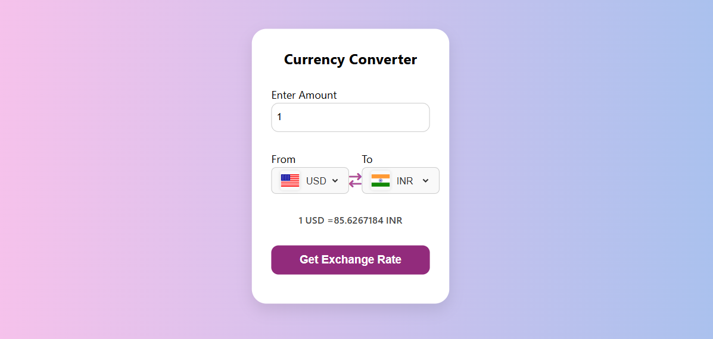

# 💱 Currency Converter

A simple and responsive currency converter built using **HTML**, **CSS**, and **JavaScript**. It fetches real-time exchange rates using a public API.

## 🌟 Features

- Convert between any two currencies
- Real-time exchange rates
- Clean and responsive design
- Flag icons for selected countries

## 📸 Preview

> *(Make sure your image file is named `screenshot.png` and added to the root of your repository)*

## 🔗 Live Demo

[Click here to try it! 🚀](https://ashabakshi.github.io/Currency-Converter-javascript-/)

## 🛠️ Built With

- HTML
- CSS
- JavaScript
- Exchange Rate API

## 🧠 What I Learned

- DOM manipulation in JavaScript
- Working with real-time APIs
- Creating responsive layouts with CSS
- Handling user input and dynamic data

